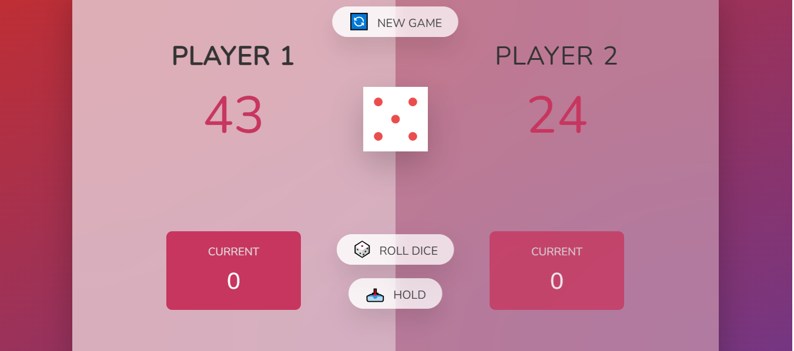

# 🎲 Pig Game

A fun dice game built with vanilla JavaScript! Roll the dice, accumulate points, but don't get greedy - rolling a 1 will reset your turn score!

## 🎮 How to Play

1. **Roll the Dice**: Click the "Roll Dice" button to roll a random dice (1-6)
2. **Accumulate Points**: Keep rolling to add points to your current score
3. **Hold Your Score**: Click "Hold" to add your current score to your total
4. **Avoid Rolling 1**: If you roll a 1, you lose all points from your current turn!
5. **First to 100 Wins**: The first player to reach 100 points wins the game

## 🚀 Getting Started

### Prerequisites

- A modern web browser (Chrome, Firefox, Safari, Edge)
- No additional installations required!

### Running the Game

1. Clone this repository:
   ```bash
   git clone https://github.com/Neginadg/pig-game.git
   ```
2. Navigate to the project folder:
   ```bash
   cd pig-game
   ```
3. Open `index.html` in your web browser
4. Start playing!

## 🛠️ Technologies Used

- **HTML5**: Structure and layout
- **CSS3**: Styling and animations
- **Vanilla JavaScript**: Game logic and interactivity

## 📁 Project Structure

```
pig-game/
├── index.html          # Main HTML file
├── style.css           # Stylesheet
├── script.js           # Game logic
├── dice-1.png          # Dice images
├── dice-2.png
├── dice-3.png
├── dice-4.png
├── dice-5.png
├── dice-6.png
├── pig-game-flowchart.png
└── README.md           # This file
```

## 🎯 Features

- ✅ Random dice roll generation
- ✅ Two-player gameplay
- ✅ Score tracking
- ✅ Visual dice display
- ✅ Responsive design
- ✅ Clean, modern UI

## 🔧 Development

To modify the game:

1. **Game Logic**: Edit `script.js`
2. **Styling**: Modify `style.css`
3. **Layout**: Update `index.html`

## 🤝 Contributing

1. Fork the repository
2. Create a feature branch (`git checkout -b feature/amazing-feature`)
3. Commit your changes (`git commit -m 'Add some amazing feature'`)
4. Push to the branch (`git push origin feature/amazing-feature`)
5. Open a Pull Request

## 📝 Game Rules (Detailed)

- Each turn, a player repeatedly rolls a die until either:
  - A 1 is rolled, or
  - The player decides to "hold"
- If a 1 is rolled, the player scores nothing and their turn ends
- If any other number is rolled, it's added to their turn total
- If a player chooses to "hold", their turn total is added to their score
- The first player to score 100 or more points wins!

## 📸 Screenshots

### Game Interface


_The main game interface showing dice, scores, and player controls_

## 🌐 Live Demo

🎮 **[Play the Game Live!](https://neginadg.github.io/pig-game/)**

Experience the Pig Game directly in your browser - no downloads required!

> **Note:** The live demo will be available once GitHub Pages is enabled for this repository. See setup instructions below.

### 🚀 Setting up GitHub Pages:

1. Go to your repository: `https://github.com/Neginadg/pig-game`
2. Click on **Settings** tab
3. Scroll down to **Pages** in the left sidebar
4. Under **Source**, select **Deploy from a branch**
5. Choose **main** branch and **/ (root)** folder
6. Click **Save**
7. Your game will be live at: `https://neginadg.github.io/pig-game/`

## 📄 License

This project is licensed under the MIT License - see the [LICENSE](LICENSE) file for details.

## 👨‍💻 Author

**Neginadg**

- GitHub: [@Neginadg](https://github.com/Neginadg)

## 🙏 Acknowledgments

- Inspired by the classic Pig dice game
- Part of JavaScript learning journey
- Built following modern web development practices

---

⭐ **Star this repository if you found it helpful!** ⭐
